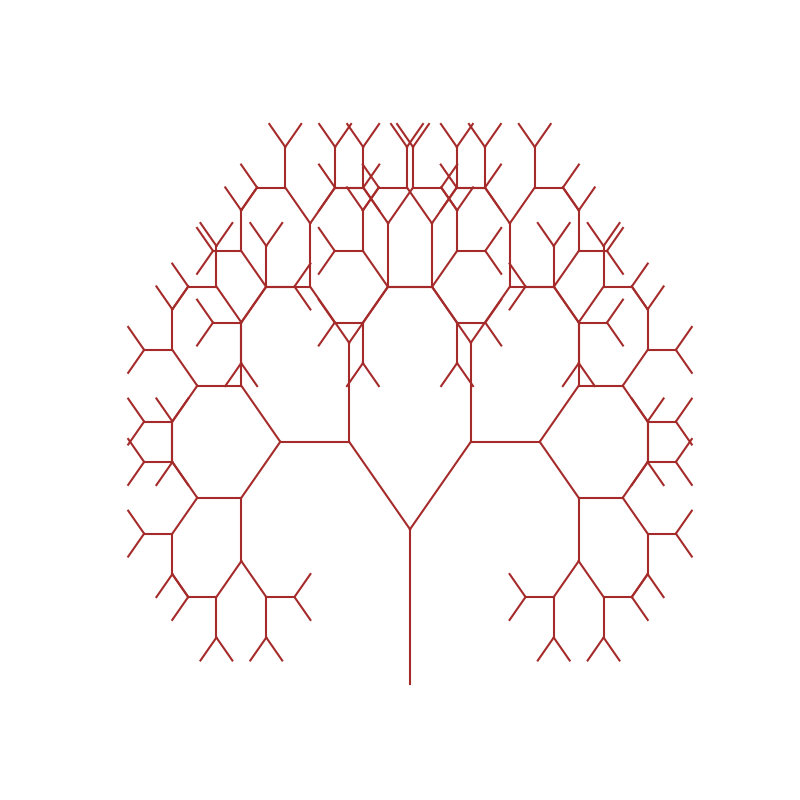

Фінальний проект.

Завдання 1. Структури даних. Сортування. Робота з однозв'язним списком

Для реалізації однозв'язного списку (приклад реалізації можна взяти з конспекту) необхідно:
написати функцію, яка реалізує реверсування однозв'язного списку, змінюючи посилання між вузлами;
розробити алгоритм сортування для однозв'язного списку, наприклад, сортування вставками або злиттям;
написати функцію, що об'єднує два відсортовані однозв'язні списки в один відсортований список.

Завдання 2. Рекурсія. Створення фрактала “дерево Піфагора” за допомогою рекурсії
Необхідно написати програму на Python, яка використовує рекурсію для створення фрактала “дерево Піфагора”. Програма має візуалізувати фрактал “дерево Піфагора”, і користувач повинен мати можливість вказати рівень рекурсії.

